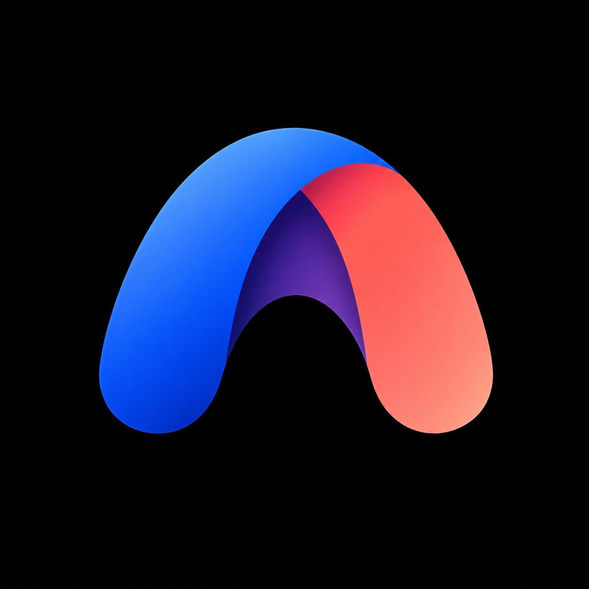
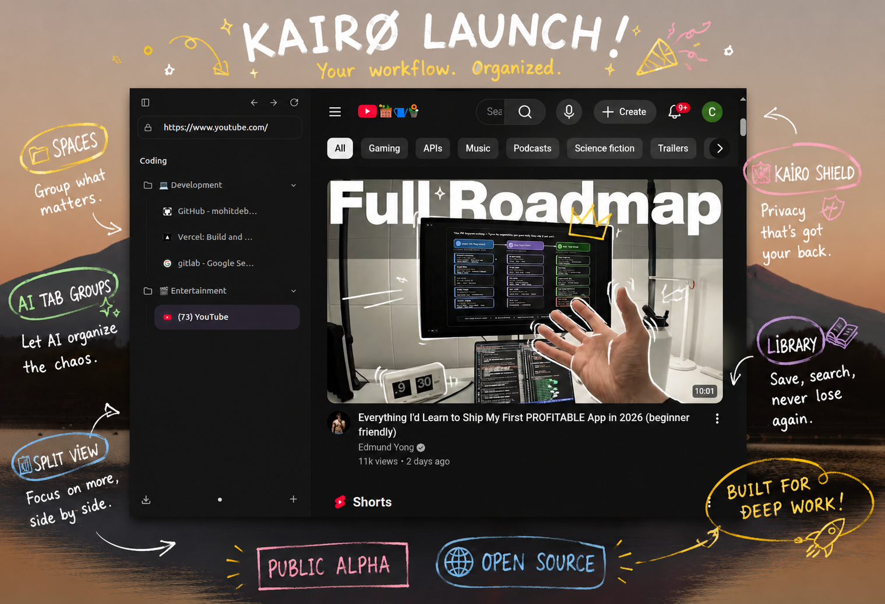

<div align="center">
  
  <h1>Kairo Browser</h1>
  <p><strong>A modern, productivity-focused browser inspired by Arc and Zen Browser.</strong></p>

  <p>
    <a href="https://github.com/mohitdebian/Kairo/actions"></a>
    <a href="https://github.com/mohitdebian/Kairo/blob/main/LICENSE"></a>
    <a href="https://github.com/mohitdebian/Kairo/stargazers"></a>
    <a href="https://github.com/mohitdebian/Kairo/network/members"></a>
  </p>
</div>

---

## 🌌 Project Vision

Kairo is not just another web browser. It is designed to be the ultimate operating system for the web.

We believe that tabs are a broken model for internet navigation. Kairo rethinks how you interact with the web by organizing your digital life into **Spaces**, **Folders**, and **AI-powered Workflows**. Designed for power users, developers, and researchers, Kairo strips away the clutter, puts your content front and center, and provides native, seamlessly integrated productivity tools.

We are building Kairo entirely in the open. Our goal is to create a community-driven, privacy-respecting alternative to corporate browsers.

---

## 📸 Screenshots

<div align="center">
  
  <p><i>Kairo's beautiful, glassmorphic UI with Vertical Tabs and Spaces.</i></p>
</div>

---

## ✨ Features

- 🌌 **Spaces & Vertical Tabs**: Separate your life into distinct workspaces (e.g., Work, Personal, Research).
- 📁 **Folder-Based Tab Management**: Group, nest, and organize your tabs the way you organize your files.
- 🤖 **AI Tab Groups & Suggestions**: Kairo's local heuristics (and optional LLM integrations) automatically organize messy tabs and suggest groupings.
- 💤 **Sleeping Tabs**: Aggressive memory management automatically sleeps inactive tabs to keep your RAM free.
- ◫ **Split View**: View multiple tabs side-by-side without leaving your primary window.
- 📚 **Library System**: A centralized hub for bookmarks, history, and saved notes.
- 🎵 **Music Integration**: Native picture-in-picture and music controls built right into the sidebar.
- ⚡ **Smart URL Autocomplete**: Type less, navigate faster.
- 🎨 **Beautiful UI**: Transparent, responsive, and thoughtfully crafted user interface.

---

## 🚀 Installation

_Pre-built binaries for macOS, Windows, and Linux are coming soon!_

For now, you can run Kairo directly from source. See the **Development Setup** below.

---

## 🛠️ Development Setup

Kairo is built on top of **Electron**, **React**, **Vite**, and **TailwindCSS**.

### Prerequisites

- [Node.js](https://nodejs.org/) (v18 or higher)
- npm or yarn

### Quick Start

```bash
# 1. Clone the repository
git clone https://github.com/mohitdebian/Kairo.git
cd Kairo

# 2. Install dependencies
npm install

# 3. Start the development server
npm run dev
```

For more detailed setup instructions, including debugging and testing, please read our [Contributing Guide](CONTRIBUTING.md).

---

## 🏗️ Architecture Overview

Kairo utilizes a highly optimized Electron + React architecture:

- **Main Process (`src/main`)**: Handles window management, tab lifecycle (`WebContentsView`), context menus, and native OS integrations.
- **Renderer Process (`src/renderer`)**: The React frontend that renders the Sidebar, Address Bar, Split Views, and Settings.
- **IPC Layer**: A robust event bridge that syncs Zustand state between the renderer and the native Electron backend.
- **Sandboxed WebViews**: Each tab is an isolated `WebContentsView`, ensuring stability and security.

For a deep dive into the codebase, check out the [Architecture Documentation](docs/ARCHITECTURE.md).

---

## 🛣️ Roadmap

We have ambitious plans for Kairo.

- **Phase 1: Core Browser** (Tabs, Spaces, Navigation, History) - _In Progress_
- **Phase 2: Productivity Features** (Split View, Command Palette, Folders)
- **Phase 3: AI Features** (Smart Grouping, Page Summarization)
- **Phase 4: Sync & Collaboration** (E2E Encrypted Sync)
- **Phase 5: Ecosystem** (Extensions API)

See our detailed [ROADMAP.md](ROADMAP.md) for checklists and upcoming milestones.

---

## 🤝 Contributing

We want Kairo to be the best open-source browser in the world, and we need your help to get there!

Whether it's squashing a bug, improving documentation, or proposing a massive new feature, we welcome all contributions.

1. Read our [Contributing Guide](CONTRIBUTING.md).
2. Check out our [Open Issues](https://github.com/mohitdebian/Kairo/issues) (look for the `good first issue` label).
3. Review our [Code of Conduct](CODE_OF_CONDUCT.md).

---

## 💬 Community

Join the conversation!

- **GitHub Discussions**: Drop into our [Discussions](https://github.com/mohitdebian/Kairo/discussions) to share ideas, ask for help, or show off your workflows.
- **Twitter/X**: Follow us for updates. [Follow](https://x.com/mohitdebian)
- **Discord**: Join our developer community. [Join Here](https://discord.com/invite/sdnfPMdMFa)

Read more about our community strategy in [docs/COMMUNITY.md](docs/COMMUNITY.md).

---

## 🛡️ Security

If you discover a security vulnerability within Kairo, please check our [Security Policy](SECURITY.md) for responsible disclosure instructions.

---

## 📄 License

Kairo is released under the [MIT License](LICENSE).
